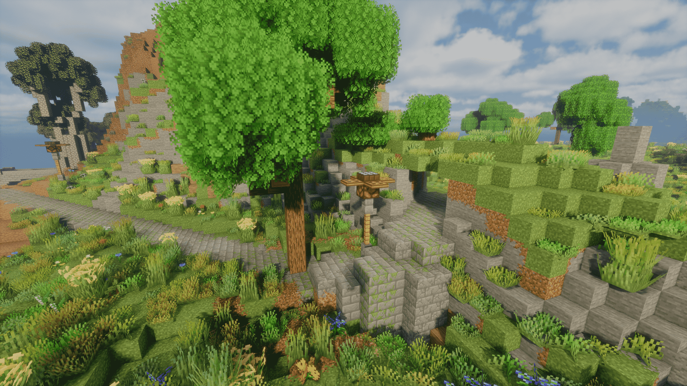
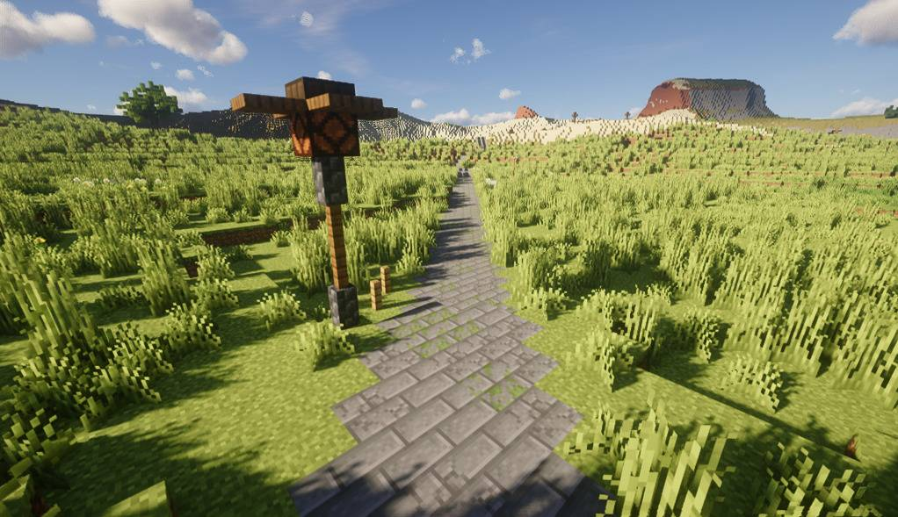
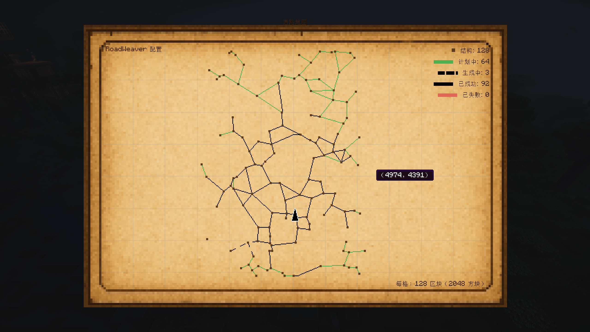

<h1>RoadWeaver</h1>

  
  
  
  

<h4><a href="README.md">English</a> | 简体中文</h4>

<table>
  <tr>
    <td></td>
    <td></td>
    <td></td>
  </tr>
</table>

<h3>自动在村庄或自定义结构之间生成美观道路的 Minecraft 模组。</h3>

## ✨主要特性

### 1. 智能道路生成

- **智能路径生成**：多种寻路算法，避开陡峭与危险区域；根据地形高度、生物群系与地面稳定性调整路线
- **贝塞尔曲线**：对寻路得到的折线路径应用贝塞尔曲线平滑插值，将其变为更自然的平滑曲线，避免生硬拐弯
- **多种道路类型**：
  - 人工道路：（石砖、石板）、（泥土、泥砖）等，也可在预设编辑器中自行搭配
  - 自然道路：按生物群系自适应道路材料
- **避障系统**：为确保道路的通过性，会对地形进行切削、填补、移除树木等处理
- **隧道 & 桥梁系统**：遇山开山、遇水搭桥
- **半砖系统**：为道路有高度差的地方填补半砖提高通过性
- **路基生成**：根据道路高度对周围高度场进行平滑插值，只在道路高于原始地形时填充路基，形成自然的"凸"字形坡面，避免道路悬空的同时又完美融入了地形

### 2. 装饰系统

- **路灯系统**：红石灯与昼夜自动控制
- **路标系统**：距离标志和方向指引
- **路边结构装饰**：在路旁随机生成座椅、小火堆等结构装饰

### 3. 配置选项

- **性能优化**：多线程异步生成并发控制；高度与地形缓存减少重复计算
- **多种路网规划算法**：提供 KNN（最稀疏）/ Delaunay（最密集）/ RNG（适中）三种路网规划算法
- **多种寻路算法**：提供 A* / 双向 A* / 流体模拟 三种寻路算法
- **道路方块自定义**：可在预设编辑器中自行搭配

### 4. 可视化工具

- **可视化调试**：道路网络地图；状态颜色（计划/生成/完成/失败）；交互（拖拽、缩放、右键传送）；统计道路数量、长度与状态
- **手动链接模式**：按自己的喜好来规划路网

## ⚡️兼容性

- 新版本（2.0.0 版本以上）完全抛弃了旧版依赖的原版指令 `/locate` 搜索机制，不会阻塞游戏主线程
- 结构预测、路网规划和寻路均在专用线程池中执行，主线程只负责驱动与结果应用

### ⚡️已知兼容性与性能问题

- 本模组（2.0.6 版本以上）与 Tectonic-V2 版 / 史诗地形 / Terralith 模组兼容，与 Tectonic-V3 版不兼容
- 本模组依赖原版机制，所以与群峦传说：次世代等颠覆了原版机制的模组不兼容

**不兼容具体表现为：**
- 道路生成极为缓慢
- 地图数据加载极为缓慢甚至长时间空白
- 地图显示已生成但走近却完全没有

**性能影响因素：**
- 世界地形复杂度
- 寻路步长、权重配置
- 道路同时生成数量与线程池数量

## 📌使用方式

- **默认自动生成**：进入世界后道路会自动在结构间生成
- **路网地图**：按 **H** 打开调试地图查看道路网络
- **配置选项**：模组 Cloth Config API 配置界面（2.0.2 以上版本已内嵌），可在新建世界界面或在游戏中按快捷键 **H** 打开地图后在右上角打开

## 💡模组灵感

模组基于 [Countered's Settlement Roads](https://modrinth.com/mod/countereds-settlement-roads) 制作，地图灵感来源 [RoadArchitect](https://github.com/FranckRJ/RoadArchitect)。

## 🎨未来计划

- [ ] 更多路边装饰？
- [x] 链接多种结构
- [ ] 链接群系？
- [ ] 更多精美建筑？
- [ ] 路途事件？
- [x] 自定义链接
- [ ] 主路系统？
- [x] 半砖过渡
- [x] 贝塞尔曲线平滑

## 🚨注意事项

>[!NOTE]注意
> - 设置里加载世界时定位的结构数量越多，创建世界的时间就越久，完整度越高
> - 道路无法在已加载区块上生成，所以，如道路未生成完毕，请不要走近该路段